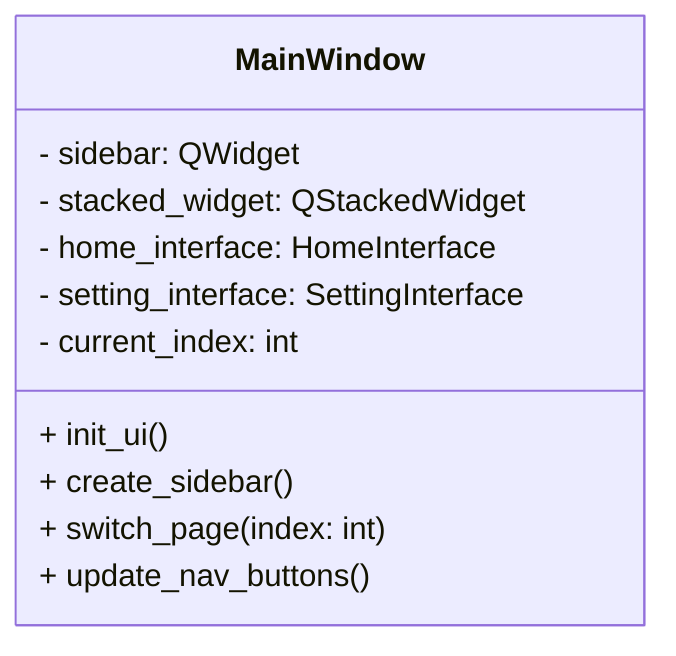
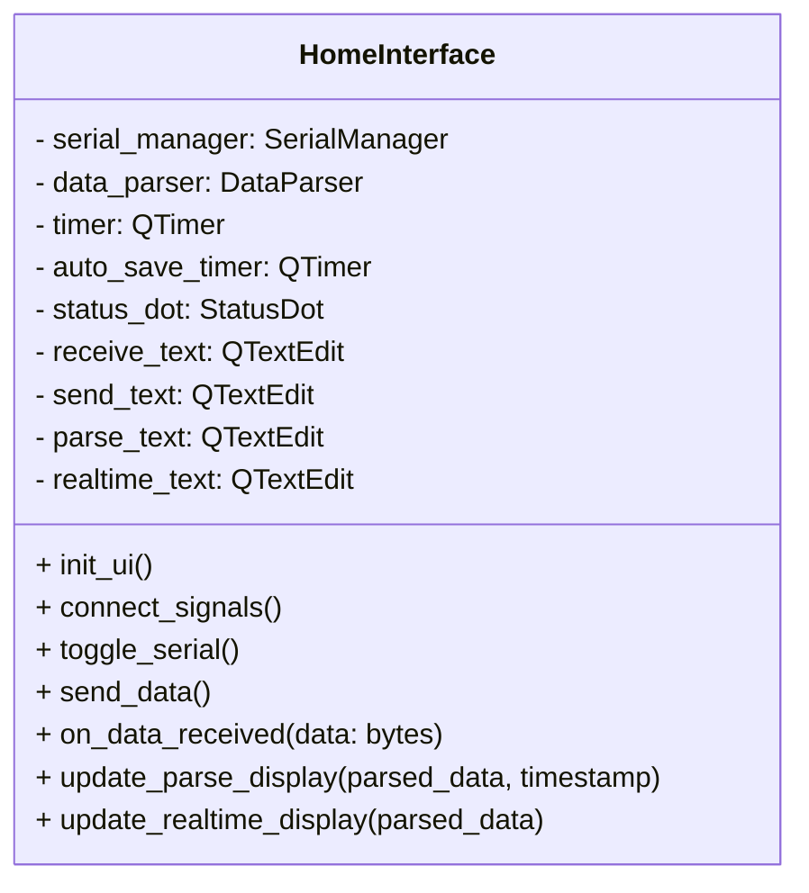
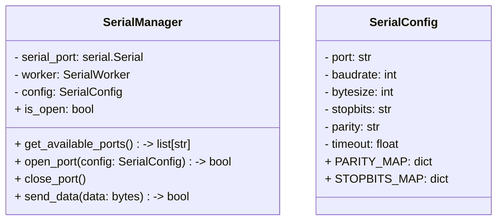
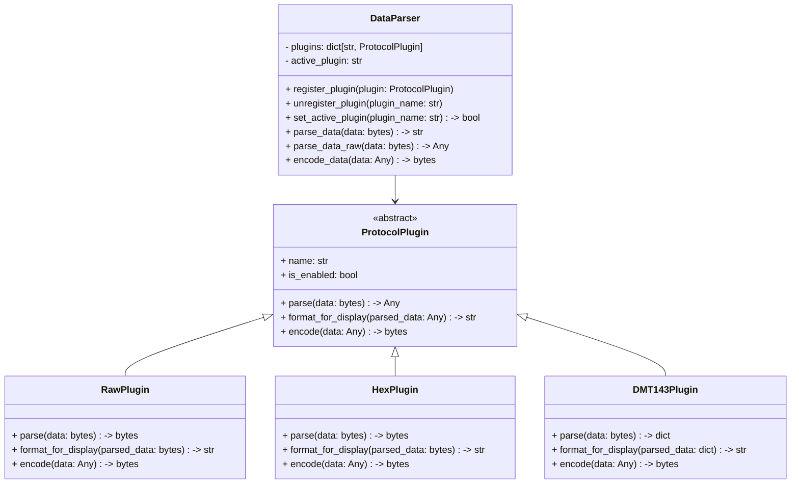
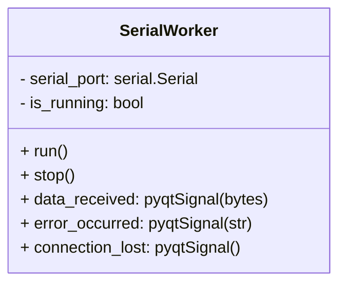
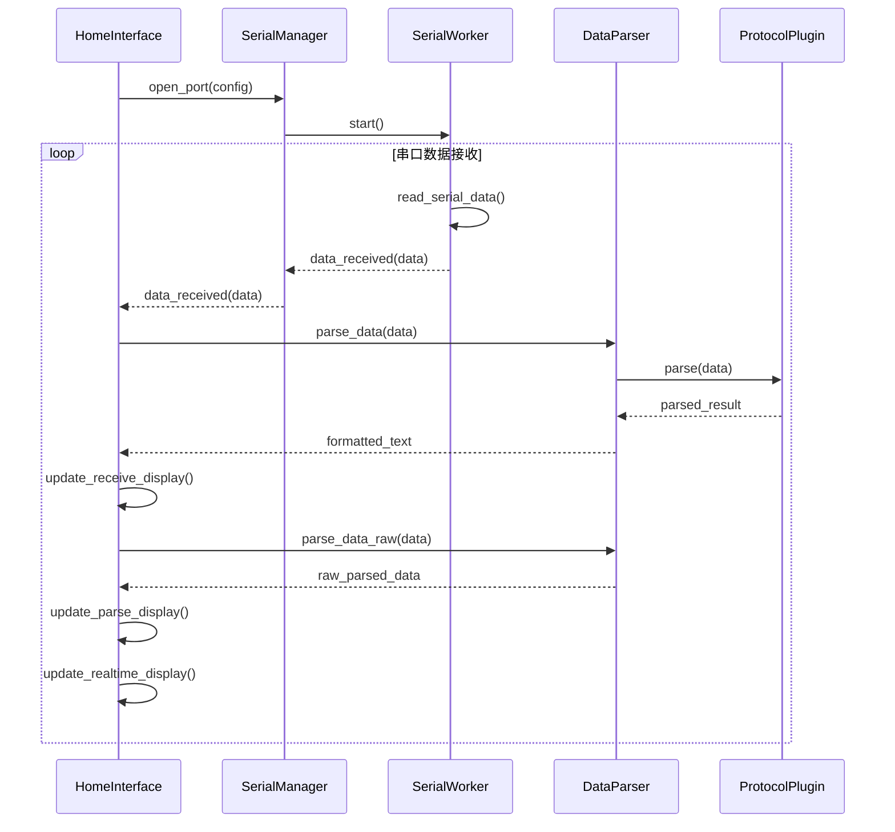
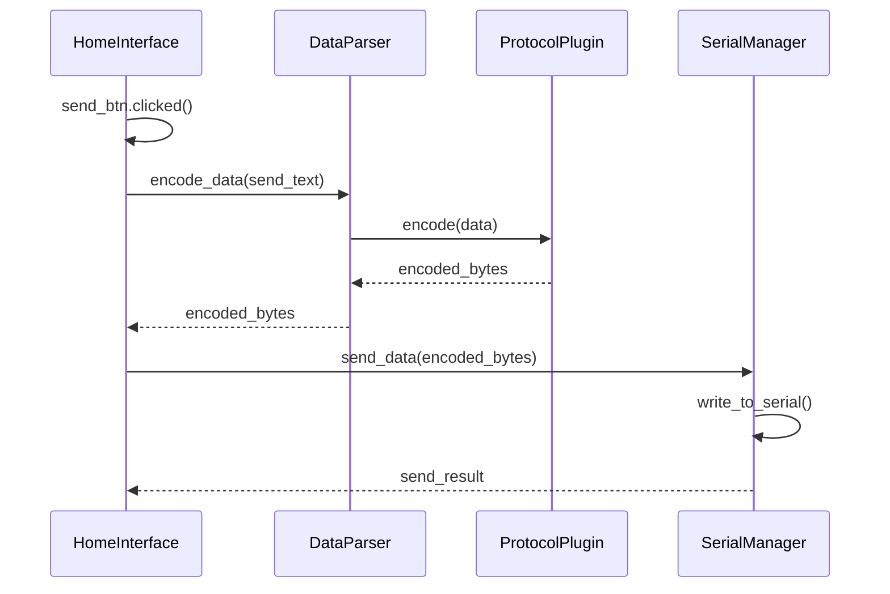
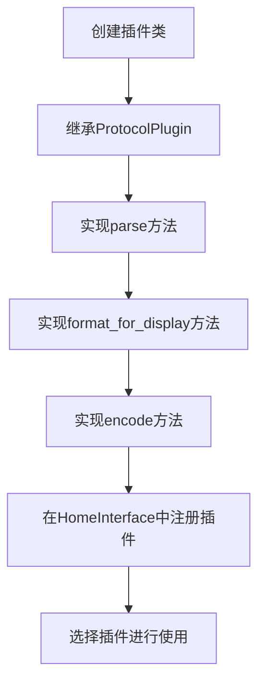
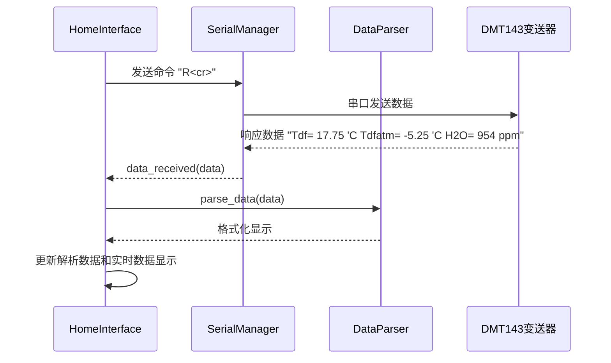

# 串口测试工具 - 架构文档

## 1. 系统概述

本项目是一个基于 PyQt5 和 pyserial 的专业串口调试助手，采用现代化的分层架构设计，支持多协议解析和插件扩展，旨在为工业设备通信提供稳定、高效的调试工具。

### 1.1 核心功能

- 自动检测可用串口
- 支持标准串口参数配置（波特率、数据位、停止位、校验位）
- 多线程数据接收，确保界面响应流畅
- 支持多种协议解析（原生、十六进制、DMT143露点变送器协议等）
- 实时数据解析和显示
- 定时发送功能
- 自动保存CSV日志
- 快捷指令管理
- 现代化的Fluent UI设计

## 2. 架构设计

### 2.1 分层架构

项目采用清晰的分层架构，各层职责单一，通过明确的接口进行通信，确保系统的可维护性和可扩展性。

```
┌─────────────────────────────────────────────────────────┐
│                     UI 层 (Presentation)                │
│ ┌─────────────┐  ┌─────────────┐  ┌───────────────────┐ │
│ │ MainWindow  │  │HomeInterface│  │SettingInterface   │ │
│ └─────────────┘  └─────────────┘  └───────────────────┘ │
├─────────────────────────────────────────────────────────┤
│                  业务逻辑层 (Business Logic)             │
│ ┌─────────────┐  ┌─────────────┐  ┌───────────────────┐ │
│ │SerialManager│  │ DataParser  │  │ Protocol Plugins  │ │
│ └─────────────┘  └─────────────┘  └───────────────────┘ │
├─────────────────────────────────────────────────────────┤
│                    通信层 (Communication)               │
│ ┌─────────────┐  ┌─────────────┐  ┌───────────────────┐ │
│ │SerialWorker │  │ SerialConfig│  │ pyserial library  │ │
│ └─────────────┘  └─────────────┘  └───────────────────┘ │
├─────────────────────────────────────────────────────────┤
│                      数据层 (Data)                       │
│ ┌─────────────┐  ┌─────────────┐  ┌───────────────────┐ │
│ │ CSV Storage │  │QuickCommands│  │ Protocol Profiles  │ │
│ └─────────────┘  └─────────────┘  └───────────────────┘ │
└─────────────────────────────────────────────────────────┘
```

### 2.2 核心模块划分

| 模块 | 主要职责 | 文件位置 | 依赖关系 |
|------|----------|----------|----------|
| MainWindow | 主窗口容器，管理页面切换 | app/main_window.py | PyQt5, HomeInterface, SettingInterface |
| HomeInterface | 串口通信主界面 | app/home_interface.py | PyQt5, SerialManager, DataParser |
| SettingInterface | 设置界面 | app/setting_interface.py | PyQt5 |
| SerialManager | 串口生命周期管理 | app/serial_manager.py | PyQt5, pyserial |
| SerialWorker | 多线程数据接收 | app/serial_manager.py | PyQt5 |
| DataParser | 数据解析和插件管理 | app/data_parser.py | PyQt5 |
| ProtocolPlugin | 协议解析插件基类 | app/data_parser.py | Python ABC |
| DMT143Plugin | DMT143协议解析 | app/plugins/dmt143_plugin.py | DataParser |
| ModbusPlugin | Modbus协议解析 | app/plugins/modbus_plugin.py | DataParser |

## 3. 关键组件设计

### 3.1 UI层组件

#### 3.1.1 MainWindow



- **功能**：主窗口框架，包含侧边栏导航和页面切换功能
- **设计亮点**：
  - 采用StackedWidget实现无闪烁页面切换
  - 侧边栏使用现代化按钮样式
  - 响应式布局设计

#### 3.1.2 HomeInterface



- **功能**：串口通信的核心界面，包含串口设置、数据收发、解析显示等功能
- **设计亮点**：
  - 双面板布局（左侧收发区，右侧解析区）
  - 实时状态指示灯
  - 多格式数据显示（原始数据、解析过程、实时参数）
  - 自动保存CSV功能

### 3.2 业务逻辑层组件

#### 3.2.1 SerialManager



- **功能**：串口设备的生命周期管理，提供统一的串口操作接口
- **设计亮点**：
  - 封装了复杂的串口参数配置
  - 自动处理多线程通信
  - 完善的错误处理机制
  - 信号驱动的事件通知

#### 3.2.2 DataParser



- **功能**：数据解析和协议管理，支持多种协议的插件扩展
- **设计亮点**：
  - 灵活的插件架构，支持动态加载协议
  - 统一的解析接口，简化扩展开发
  - 支持原始数据和格式化数据的双模式输出
  - 内置多种常用协议插件

### 3.3 通信层组件

#### 3.3.1 SerialWorker



- **功能**：独立的工作线程，负责串口数据的持续读取
- **设计亮点**：
  - 采用QThread实现，避免阻塞UI线程
  - 高效的循环读取机制
  - 完善的错误处理和连接监控
  - 信号驱动的数据传输

## 4. 数据流与通信

### 4.1 数据接收流程



### 4.2 数据发送流程



## 5. 扩展机制

### 5.1 插件系统设计

项目采用灵活的插件架构，允许用户通过实现`ProtocolPlugin`接口来扩展支持的协议类型。

```python
class MyCustomPlugin(ProtocolPlugin):
    def __init__(self):
        super().__init__("MyProtocol")
    
    def parse(self, data: bytes) -> Optional[Any]:
        # 实现自定义协议解析逻辑
        pass
    
    def format_for_display(self, parsed_data: Any) -> str:
        # 实现数据格式化逻辑
        pass
    
    def encode(self, data: Any) -> Optional[bytes]:
        # 实现数据编码逻辑
        pass
```

### 5.2 插件注册流程



### 5.3 协议支持现状

| 协议名称 | 插件类名 | 支持功能 | 状态 |
|---------|---------|---------|------|
| 原始数据 | RawPlugin | 文本数据解析 | ✅ 已实现 |
| 十六进制 | HexPlugin | 十六进制数据解析 | ✅ 已实现 |
| DMT143 | DMT143Plugin | 露点变送器协议 | ✅ 已实现 |
| Modbus | ModbusPlugin | Modbus协议 | ⏳ 开发中 |

## 6. DMT143通信流程

### 6.1 通信基础

DMT143露点变送器采用ASCII文本协议进行通信，所有命令和响应均以文本形式传输，命令以回车符`<cr>`结束。

### 6.2 核心命令

| 命令 | 功能 | 格式 | 示例 |
|------|------|------|------|
| R | 读取实时测量数据 | `R<cr>` | `R` |
| RUN | 连续输出测量数据 | `RUN<cr>` | `RUN` |
| INTV | 设置测量输出间隔 | `INTV [n xxx]<cr>` | `intv 1 min` |
| filt | 设置数据过滤值 | `filt [x.xxx]<cr>` | `filt 0.5` |
| PRES | 设置压力补偿值 | `PRES [pp.ppppp]<cr>` | `pres 3` |
| XPRES | 设置临时压力补偿值 | `XPRES [pp.ppppp]<cr>` | `xpres 3.5` |
| ? | 显示帮助信息 | `?<cr>` | `?` |
| RESET | 重置设备 | `RESET<cr>` | `RESET` |

### 6.3 数据格式

#### 6.3.1 测量数据响应

```
Tdf= 17.75 'C Tdfatm= -5.25 'C H2O= 954 ppm
```

- **Tdf**: 露点温度，单位为℃或℉
- **Tdfatm**: 大气压露点温度，单位为℃或℉
- **H2O**: 湿度，单位为ppm

#### 6.3.2 参数设置响应

```
Filter         :0.500
Pressure       :3.000 bar
```

### 6.4 完整通信流程



### 6.5 通信特性

1. **波特率支持**: 默认9600，支持多种波特率配置
2. **数据格式**: ASCII文本格式，易于解析和调试
3. **错误处理**: 当通信错误时，设备可能输出星号`****`
4. **连续测量**: RUN模式下，设备会持续输出测量数据
5. **参数配置**: 支持压力补偿、过滤值等参数的设置

## 7. 技术栈与依赖

| 技术/库 | 版本 | 用途 | 来源 |
|---------|------|------|------|
| Python | 3.7+ | 开发语言 | 内置 |
| PyQt5 | 5.15+ | UI框架 | pip |
| pyserial | 3.5+ | 串口通信 | pip |
| qfluentwidgets | 1.0+ | 现代化UI组件 | pip |
| regex | 2023+ | 正则表达式解析 | pip |
| csv | 内置 | 日志保存 | 内置 |
| datetime | 内置 | 时间戳生成 | 内置 |

## 8. 配置与部署

### 8.1 安装依赖

```bash
pip install -r requirements.txt
```

### 8.2 运行程序

```bash
python main.py
```

### 8.3 开发环境要求

- Python 3.7及以上版本
- Windows 10/11操作系统
- PyCharm或VS Code编辑器
- Git版本控制

## 9. 性能与可靠性

### 9.1 性能优化

- **多线程设计**：数据接收使用独立线程，确保UI响应流畅
- **高效数据处理**：正则表达式预编译，减少解析时间
- **内存管理**：合理控制缓冲区大小，避免内存泄漏
- **UI更新优化**：批量更新UI，减少重绘次数

### 9.2 可靠性设计

- **异常处理**：全面的try-except块，确保系统稳定运行
- **连接监控**：自动检测串口连接状态，异常时及时通知用户
- **数据验证**：严格的数据格式验证，防止解析错误
- **日志记录**：详细的操作日志，便于问题排查

## 10. 未来扩展方向

1. **支持更多工业协议**：
   - Modbus RTU/TCP
   - CAN bus
   - OPC UA
   - EtherNet/IP

2. **功能增强**：
   - 波形显示功能
   - 数据可视化图表
   - 多串口同时监控
   - 远程通信支持

3. **用户体验优化**：
   - 主题切换功能
   - 快捷键支持
   - 导出更多格式的日志
   - 历史数据回放

4. **部署优化**：
   - 支持跨平台运行（Linux, macOS）
   - 单文件打包发布
   - 自动更新功能

## 11. 总结

本项目采用现代化的分层架构设计，结合PyQt5的强大UI能力和pyserial的稳定通信能力，打造了一个功能齐全、性能优良的串口调试工具。通过插件系统的设计，实现了协议的灵活扩展，为工业设备通信调试提供了可靠的解决方案。

项目的核心优势在于：
- 清晰的分层架构，易于维护和扩展
- 多线程设计，确保界面响应流畅
- 插件系统，支持协议的灵活扩展
- 现代化的UI设计，提升用户体验
- 全面的错误处理，确保系统稳定运行

未来，项目将继续扩展协议支持和功能增强，为工业自动化领域提供更强大的调试工具。